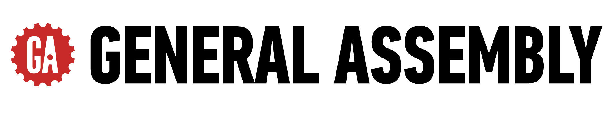

# General Assembly | Enterprise Curriculum

This organization holds General Assembly's **internal, client-specific enterprise curriculum** — the program templates used by GA staff, contracted curriculum developers, and instructors. All repositories are private.

> **Are you a student?** No — this organization isn't for you, and your course materials aren't here. You're added to your own cohort's repository in the **ga-deliveries** organization. Watch for a GitHub email invitation, or ask your instructor for the link.

---

<strong>GA team members — how to request access</strong>

 

1. Make sure you have a **personal GitHub account** with **two-factor authentication (2FA) enabled** — https://github.com/settings/security
2. Request access through **[GA's GitHub access request channel](#)** _(Slack channel — TBD)_ <!-- TODO: replace (#) with the Slack channel link once it is created --> with your **role** and the **team or program** you're joining.

Access is granted at the **organization level**, not per repository. Once you're approved and added as an org member, you'll have access across this organization — there's no need to request individual repos.

---

**Questions, or not sure why you're here?**
If you're not a GA student or team member, head to **[generalassemb.ly](https://generalassemb.ly)** to explore our courses and get in touch.
